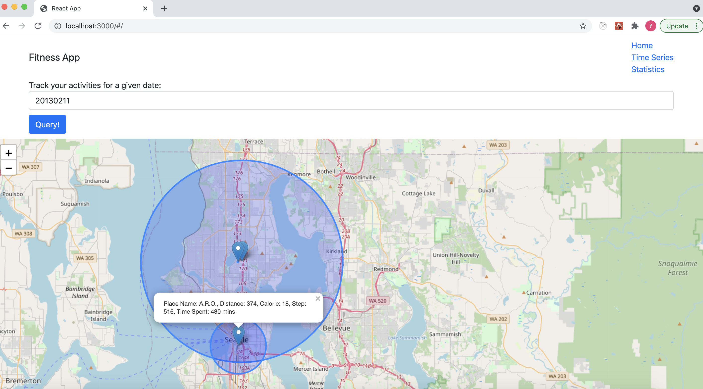
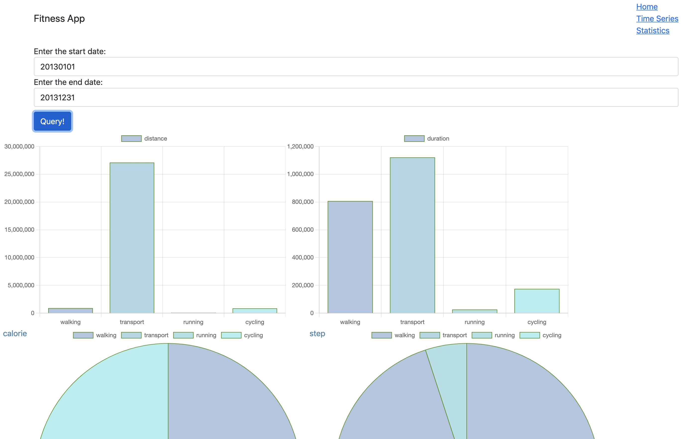
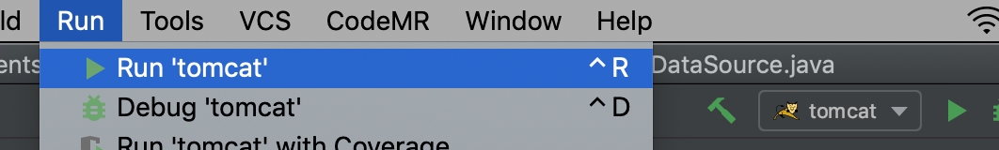
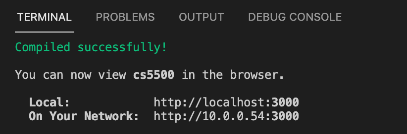

# Fitness App

## Features Delivered
- Overview
    - In the fitness app, we delivered 3 webpages for users to track the calories, steps, distance, duration and location of their daily activities (e.g. walking, transport, running, cycling...).
    - The webpages include: heat map, timeseries analysis, and dashboard page

- Heat Map
    - In the heatmap page, the user inputs a date, then the app will query the locations which the user has visited for the given date, and display the places on the map based on their longitude and latitude.
    - When the user clicks on the location, it will show a popup, displaying the calories, steps, distance and time spent in the location.
    
    
- Timeseries Graph
    - In the timeseries page, we display the most recent 100 walking activities for the user, and show the variation in their attributes such as calories, steps, distance.
    - By clicking on the labels, the user can also filter on which information to display. For example, it can only show the calories vs steps, or steps vs distance etc, which supports the user to track the activities and see their fitness progress.
    

- Dashboard Page    
    - In the dashboard page, the user inputs a time range, and the app will show the comparison in calories, steps, distance and duration across different activites in this given period. 
    - For example, the user can get an idea of how much calories the user spend when walking compared with cycling, or how many steps the user take when walking compared with running during the given period of time.
    

## How to run the app
- Backend
    - The backend is in Java, hosted by tomcat. 
    - To build the backend, open the IntelliJ, then click Run -> Run tomcat
     
- Frontend
    - The frontend is written in React, hosted by node.
    - To build the frontend, open a terminal in the folder and run `npm start`, and you'll see
    
    - Then open a browser, and visit `localhost:3000`
